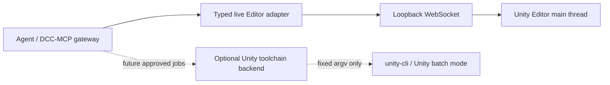

# Unity automation architecture benchmark

This adapter was reviewed against pinned versions of three Unity automation projects before its first public
release. The comparison is about architecture and contracts; no third-party source code is bundled
or copied into this repository.

## Source snapshots

| Project | Snapshot | Primary role | License |
| --- | --- | --- | --- |
| [RageAgainstThePixel/unity-cli](https://github.com/RageAgainstThePixel/unity-cli/tree/c4f45b952c3e23beadfb442fc4c6d5920402c217) | `c4f45b9`, CLI 3.0.1 | Hub, Editor, license, project, batch, build, and UPM lifecycle automation | [MIT](https://github.com/RageAgainstThePixel/unity-cli/blob/c4f45b952c3e23beadfb442fc4c6d5920402c217/LICENSE) |
| [CoplayDev/unity-mcp](https://github.com/CoplayDev/unity-mcp/tree/c14de1e6dc01ab42d2bb358730cff954bce0ce6b) | `c14de1e`, 10.1.0 | Python MCP server plus Unity Editor plugin and broad authoring tools | [MIT](https://github.com/CoplayDev/unity-mcp/blob/c14de1e6dc01ab42d2bb358730cff954bce0ce6b/LICENSE) |
| [IvanMurzak/Unity-MCP](https://github.com/IvanMurzak/Unity-MCP/tree/73086e74924efc7ebf4430d3b4fa1ae44d49adaa) | `73086e7`, 0.86.0 | Editor/runtime plugin and CLI communicating with an external C# MCP server over SignalR | [Apache-2.0](https://github.com/IvanMurzak/Unity-MCP/blob/73086e74924efc7ebf4430d3b4fa1ae44d49adaa/LICENSE) |

## Product boundary

The projects solve two different automation planes. DCC-MCP Unity keeps them separate:

- The live plane owns low-latency inspection and undoable Editor authoring.
- A future toolchain plane may own project creation, compile, test, and build jobs.
- Hub installation, license management, arbitrary Editor arguments, and credentials are not normal
  MCP tools.

## Decisions adopted for the first release

1. **Explicit commands, not ambient code execution.** The Editor package accepts a fixed method
   allowlist. It does not expose arbitrary C#, reflection calls, menu execution, shell commands, or
   unconstrained file writes.
2. **One main-thread boundary.** WebSocket I/O is asynchronous; commands enter through a bounded
   queue and run from `EditorApplication.update`.
3. **Fail-closed mutation lifecycle.** Each undoable GameObject mutation has its own Undo group and
   rolls back on failure. Mutations are rejected during compile, asset update, and Play Mode.
4. **Bounded transport and output.** Incoming messages, pending requests, queue lifetime, scene
   snapshots, vector values, and captured Console output all have explicit limits.
5. **Target evidence.** The bridge handshake includes product name, project path/hash, Unity version, process
   ID, and a session ID stable across domain reloads. Agents inspect the project before mutation.
6. **Diagnostic loop.** Project inspection reports Editor readiness, and `editor.read_console`
   provides a bounded read-only view of messages captured after package load.
7. **Version preflight.** The installer reads `ProjectSettings/ProjectVersion.txt` and rejects Unity
   versions older than 2018.4.36f1 before changing the project.
8. **No blind mutation retry.** A timeout is ambiguous: Unity may have completed work near the
   boundary. The workflow requires project and scene inspection before deciding what to do next.

## Deferred extensions

- Add a separate optional backend for a pinned `unity-cli` version. It must use fixed argument
  arrays, `shell=False`, bounded output and timeouts, credential redaction, and explicit approval for
  project creation, compile, test, build, or GUI launch.
- Add core-supported multi-instance routing keyed by project hash and session ID. Until then,
  concurrent Editors use one adapter and a unique bridge port/URL pair per Editor.
- Add `tests.run`, build, package, and other cross-domain-reload operations only with a persistent
  job protocol (`request_id`, processing state, reconnect, completion, cancellation).
- Extend the licensed Unity version matrix beyond EditMode only when a new capability needs PlayMode
  or player-build proof. Static CI is not presented as live Editor proof.
- Expand authoring in bounded vertical slices: tests/build first, then carefully typed components,
  prefabs, materials, and assets.

## Capabilities intentionally rejected

- Runtime compilation or execution of arbitrary C#.
- Calling arbitrary public or private methods through reflection.
- Generic object patching with an unconstrained type/property surface.
- Arbitrary `unity-cli run`, Unity Hub, menu item, or package URL passthrough.
- License and service-account credentials supplied as model arguments.
- Automatic retry of non-idempotent scene mutations.
- Cloud identity, telemetry, asset-generation providers, or third-party secret stores in the core
  adapter.

## Evidence consulted

- `unity-cli` separates project/version detection and Editor execution, uses argument arrays with
  `shell: false`, and maintains real Unity integration workflows: [project parser](https://github.com/RageAgainstThePixel/unity-cli/blob/c4f45b952c3e23beadfb442fc4c6d5920402c217/src/unity-project.ts#L61-L97), [process execution](https://github.com/RageAgainstThePixel/unity-cli/blob/c4f45b952c3e23beadfb442fc4c6d5920402c217/src/utilities.ts#L167-L293), [integration workflow](https://github.com/RageAgainstThePixel/unity-cli/blob/c4f45b952c3e23beadfb442fc4c6d5920402c217/.github/workflows/integration-tests.yml#L1-L74).
- Coplay uses project hashes for instance routing, keeps the active instance per MCP session,
  dispatches Editor work through a main-thread queue, and provides a large tool catalog; it also
  exposes optional arbitrary C# that is explicitly not a sandbox: [instance middleware](https://github.com/CoplayDev/unity-mcp/blob/c14de1e6dc01ab42d2bb358730cff954bce0ce6b/Server/src/transport/unity_instance_middleware.py#L50-L95), [dispatcher](https://github.com/CoplayDev/unity-mcp/blob/c14de1e6dc01ab42d2bb358730cff954bce0ce6b/MCPForUnity/Editor/Services/Transport/TransportCommandDispatcher.cs#L70-L194), [execute-code warning](https://github.com/CoplayDev/unity-mcp/blob/c14de1e6dc01ab42d2bb358730cff954bce0ce6b/Server/src/services/tools/execute_code.py#L1-L9).
- Ivan Murzak's implementation uses stable project/session identity and main-thread dispatch. Its
  dynamic script execution and reflection-backed capabilities give it a broader operation surface
  than this adapter's fixed allowlist:
  [architecture](https://github.com/IvanMurzak/Unity-MCP/blob/73086e74924efc7ebf4430d3b4fa1ae44d49adaa/docs/claude/architecture.md#L3-L15), [instance identity](https://github.com/IvanMurzak/Unity-MCP/blob/73086e74924efc7ebf4430d3b4fa1ae44d49adaa/Unity-MCP-Plugin/Packages/com.ivanmurzak.unity.mcp/Editor/Scripts/Services/ProjectInstanceService.cs#L53-L106), [dynamic script execution](https://github.com/IvanMurzak/Unity-MCP/blob/73086e74924efc7ebf4430d3b4fa1ae44d49adaa/Unity-MCP-Plugin/Packages/com.ivanmurzak.unity.mcp/Editor/Scripts/API/Tool/Script.Execute.cs#L244-L310).
